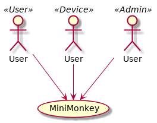

Mini Monkey (pre-alpha)
=======================

[](https://www.apache.org/licenses/LICENSE-2.0)
[](https://travis-ci.org/Raphexion/minimonkey)
[](https://codecov.io/gh/Raphexion/minimonkey?branch=master)
[](https://hub.docker.com/r/raphexion/minimonkey)


Mini Monkey is a minimal message routing system.
Considerably smaller and simpler than [MQTT](https://en.wikipedia.org/wiki/MQTT).

It should be possible to implement a client in under one hour.

Project Plan
------------

- [ ] Add benchmark tests
- [ ] Add more tests concerning permissions
- [ ] Add more examples in README

Three perspectives
------------------

When designing Mini Monkey we need to focus on our three users:

1. Controllers that want to primarily consume data and control devices
2. Devices that primarily will produce data and be be controlled
3. Administrators that needs to configure access controls



Design decisions
----------------

Mini Monkey is a publish / subscribe broker than only support routing keys.
Especially it does not implement topics.

Mini Monkey only cares about routing blobs.
Especially it does not use JSON / Protocol-buffers or other serialization.

Mini Monkey is designed around small payloads.

Mini Monkey is desgined to be very simple and concise.
The goal is to reach feature-completion fast and leave as much as possible outside the broker.
The protocol and architecture should be so easy that anyone can implement a client in under and hour.

Mini Monkey uses stateful connections where previous _commands_ affect future commands.
The reasons is to keep all payloads small.

All messages, both to and from the server follow a trivial binary protocol.

```
1 byte  : Function Code
2 byte  : Payload length
N bytes : Optional payload
```

Bootstrap and the God Token
---------------------------

Then Mini Monkey starts it will read the environment variable **god_token**.
The purpose is to have one token that can bootstrap the broker.
This token can be used to provision the broker and the routing keys (rooms).

| Variable  | Comment                                 |
|-----------|-----------------------------------------|
| god_token | A token that has all rights             |


Port
----

Mini Monkey only uses one port **1773**.
Connections are made over TCP/IP.

| Port | Comment                                 |
|------|-----------------------------------------|
| 1773 | Controllers, Devices and Administrators |


Function Codes
--------------

| Code | Comment                                                         |
|------|-----------------------------------------------------------------|
| 0x00 | Reseved for future use                                          |
| 0x01 | Authenticate with token                                         |
| 0x02 | Set current routing key (persistent until changed or reconnect) |
| 0x03 | Publish binary payload                                          |
| 0x04 | Subscribe to current routing key                                |
| 0x04 | Subscribe to current routing key                                |
| 0x10 | Add admin permissions for token                                 |
| 0x11 | Revoke admin permissions for token                              |
| 0x12 | Add publish permissions for token                               |
| 0x13 | Revoke publish permissions for token                            |
| 0x14 | Add subscription permissions for token                          |
| 0x15 | Revoke subscription permissions for token                       |
| 0x16 | Add login                                                       |
| 0x17 | Revoke login                                                    |
| 0xEE | Error message                                                   |
| 0xFF | Debug message                                                   |

Examples
--------

A client logins in and publish 3 messages:

| Purpose          | Bytes (little endian) | Optional Payload         | Comment        |
|------------------|-----------------------|--------------------------|----------------|
| Auth with token  | 0x01 0x04 0x00        | 0x41 0x42 0x43 0x44      | Token: ABCD    |
| Pick routing key | 0x02 0x03 0x00        | 0x51 0x52 0x53           | Key: QRS       |
| Publish          | 0x03 0x04 0x00        | 0x01 0x02 0x03 0x04 0x05 | Binary payload |
| Publish          | 0x03 0x02 0x00        | 0xFF 0xEE                | Binary payload |
| Pick routing key | 0x02 0x04 0x00        | 0x51 0x52 0x53 0x032     | Key: QRS2      |
| Publish          | 0x03 0x01 0x00        | 0xAB                     | Binary payload |
