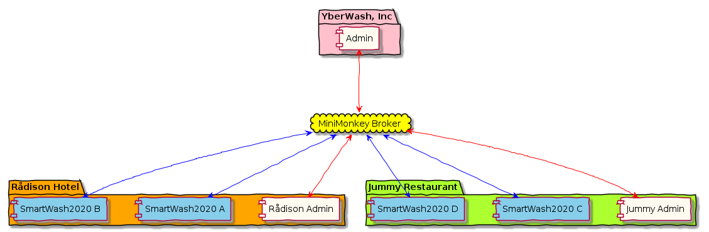

# Mini Monkey (pre-alpha)

[](https://travis-ci.org/mini-monkey/mini-monkey)
[](https://codecov.io/gh/mini-monkey/mini-monkey?branch=master)
[](https://hub.docker.com/r/minimonkey/mini-monkey)
[](https://www.apache.org/licenses/LICENSE-2.0)


Mini Monkey is a minimal message routing system.
Considerably smaller and simpler than [MQTT](https://en.wikipedia.org/wiki/MQTT).
Like other message brokers (RabbitMQ, EMQX, VerneMQ), Mini Monkey is implemented in Erlang.

When to consider Mini Monkey:

1.  Many embedded devices (microcontrollers)
2.  Large clusters of industrial scale IoT devices
3.  Need for programmatically provisioning

## Quick Start

Start the broker:

```sh
docker run -d -p 1773:1773 -e god_token=myToken minimonkey/mini-monkey
```

Provision the broker:

```sh
wget https://github.com/mini-monkey/minimonkeyrs/releases/latest/download/mm_provision
chmod +x mm_provision

mm_provision --host localhost --port 1773 --token adminToken --file provision.yaml
```

## Clients

- [Rust implementation](https://github.com/mini-monkey/minimonkeyrs)
- [Client in Acceptence Tester (python)](https://github.com/Raphexion/minimonkey-tests/blob/master/libraries/MiniMonkey.py)
- [Demo client in go](https://github.com/Raphexion/minimonkey_pubsub)

## Project Plan

- [ ] Streamline debug/error messages
- [ ] Add benchmark tests
- [ ] Add more tests concerning permissions
- [ ] Add more examples in README
- [ ] Death Message

## Three perspectives

When designing Mini Monkey we need to focus on our three main uses-cases:

1. An embedded device that produces data - and - is remotely controllable.
2. A controller is consuming data from one or more producers - and - sends control messages to the embedded devices.
3. An administrator that needs to programmatically provision the broken.


## User story

YberWash, Inc has developed a internet connected - industrial - dish washing machine.
It is called SmartWash2020.

Currently they have two big customers, Rådison Hotel and Jummy Restaurant.
They have bought 2 SmartWash2020 machine each.



The SmartWash2020 provides realtime feedback to the customer:

- Which wash program is running.
- How much time is left on the program.
- What is the temperature of the water.
- How dirty is the water.

Moreover, it is possible to remote control the SmartWash2020.
It is possible to:

- Start a machine remotely.
- Stop the machine and drain the water.
- Change wash program.
- Increase and decrease the water temperature.

Finally, to provide customer feedback, YberWash will collect some running statistics:

- Each time the washer starts and stops.
- Energy usage.

The YberWash admin can provision the Mini Monkey broker programmatically.
Making sure that only the correct device/person can publish/subscribe.
Infrastructure-as-code.

```yaml
rådison-hotel-rooms:
  - name: /RådisonHotel/SmartWash2020 AAA/Info/TimeLeft
    tokens_that_can_publish:
      - SecretToken-Machine-AAA
    tokens_that_can_subscribe:
      - SecretToken-Rådison-Admin

  - name: /RådisonHotel/SmartWash2020 AAA/Info/EnergyUsage
    tokens_that_can_publish:
      - SecretToken-Machine-AAA
    tokens_that_can_subscribe:
      - SecretToken-Rådison-Admin

  - name: /RådisonHotel/SmartWash2020 AAA/Command/Stop Machine
    tokens_that_can_publish:
      - SecretToken-Rådison-Admin
      - SecretToken-YberWash-Admin
    tokens_that_can_subscribe:
      - SecretToken-Machine-AAA

  - name: /RådisonHotel/SmartWash2020 BBB/Info/TimeLeft
    tokens_that_can_publish:
      - SecretToken-Machine-BBB
    tokens_that_can_subscribe:
      - SecretToken-Rådison-Admin

  - name: /RådisonHotel/SmartWash2020 BBB/Info/EnergyUsage
    tokens_that_can_publish:
      - SecretToken-Machine-BBB
    tokens_that_can_subscribe:
      - SecretToken-Rådison-Admin

  - name: /RådisonHotel/SmartWash2020 BBB/Command/Stop Machine
    tokens_that_can_publish:
      - SecretToken-Rådison-Admin
      - SecretToken-YberWash-Admin
    tokens_that_can_subscribe:
      - SecretToken-Machine-BBB

yummy-restaurant-rooms:
  - name: /RådisonHotel/SmartWash2020 AAA/Info/TimeLeft
    tokens_that_can_publish:
      - SecretToken-Machine-AAA
    tokens_that_can_subscribe:
      - SecretToken-Rådison-Admin

  - name: /RådisonHotel/SmartWash2020 AAA/Info/EnergyUsage
    tokens_that_can_publish:
      - SecretToken-Machine-AAA
    tokens_that_can_subscribe:
      - SecretToken-Rådison-Admin

  - name: /RådisonHotel/SmartWash2020 AAA/Command/Stop Machine
    tokens_that_can_publish:
      - SecretToken-Rådison-Admin
      - SecretToken-YberWash-Admin
    tokens_that_can_subscribe:
      - SecretToken-Machine-AAA

  - name: /RådisonHotel/SmartWash2020 BBB/Info/TimeLeft
    tokens_that_can_publish:
      - SecretToken-Machine-BBB
    tokens_that_can_subscribe:
      - SecretToken-Rådison-Admin

  - name: /RådisonHotel/SmartWash2020 BBB/Info/EnergyUsage
    tokens_that_can_publish:
      - SecretToken-Machine-BBB
    tokens_that_can_subscribe:
      - SecretToken-Rådison-Admin

  - name: /RådisonHotel/SmartWash2020 BBB/Command/Stop Machine
    tokens_that_can_publish:
      - SecretToken-Rådison-Admin
      - SecretToken-YberWash-Admin
    tokens_that_can_subscribe:
      - SecretToken-Machine-BBB
```

## Design decisions

Mini Monkey is a publish / subscribe broker than only support routing keys (called rooms).
Especially it does not implement topics.

Mini Monkey only cares about routing blobs.
Especially it does not use JSON / Protocol-buffers or other serialization.

Mini Monkey is designed around small payloads.

Mini Monkey is desgined to be very simple and concise.
The goal is to reach feature-completion fast and leave as much as possible outside the broker.
The protocol and architecture should be so easy that it is possible to implement a simple client in one day.

Mini Monkey uses stateful connections where previous _commands_ affect future commands.
The reasons is to keep all payloads small.

## Bootstrap and the God Token

Then Mini Monkey starts it will read the environment variable **god_token**.
The purpose is to have one token that can bootstrap the broker.
This token can be used to provision the broker and the routing keys (rooms).

| Variable  | Comment                     |
| --------- | --------------------------- |
| god_token | A token that has all rights |

## Port

Mini Monkey only uses one port **1773**.
Connections are made over TCP/IP.

| Port | Comment                                 |
| ---- | --------------------------------------- |
| 1773 | Controllers, Devices and Administrators |

## Death Message

Sometimes it is good to communicate when a user disappears.
It is therefore (not implemented yet) to set a message, that
will be delivered if the user disconnects unexpected.

## Protocal

All messages, both to and from the server follow a trivial binary protocol.

| Size    | Comment          |
| ------- | ---------------- |
| 1 bit   | Big endian size? |
| 7 bits  | Function Code    |
| 2 bytes | Payload size     |
| N bytes | Optional payload |

## Function Codes

| Code | Comment                                            | Payload meaning                      |
| ---- | -------------------------------------------------- | ------------------------------------ |
| 0x00 | Reseved for future use                             |                                      |
| 0x01 | Authenticate with token                            | Token                                |
| 0x02 | Enter room (persistent until changed or reconnect) | Room                                 |
| 0x03 | Publish binary payload                             | Published data                       |
| 0x04 | Subscribe to current room                          | Tag                                  |
| 0x10 | Add admin permissions for token                    | Additional admin token in room       |
| 0x11 | Revoke admin permissions for token                 | Token to be revoked                  |
| 0x12 | Add publish permissions for token                  | Additional publish token in room     |
| 0x13 | Revoke publish permissions for token               | Token to be revoked                  |
| 0x14 | Add subscription permissions for token             | Additional subs. token in room       |
| 0x15 | Revoke subscription permissions for token          | Token to be revoked                  |
| 0x16 | Add login                                          | Additional token that can login      |
| 0x17 | Revoke login                                       | Revoke a token for login             |
| 0x20 | Set death message payload                          | Data that is sent when disconnect    |
| 0x21 | Set death message room                             | Room where the messages is published |
| 0x22 | Enable death message                               |                                      |
| 0x23 | Disable death message                              |                                      |
| 0x30 | Forward messages in this room to another room      | Destiantion room for forward         |
| 0x31 | Unforward message in this room to anther room      | Destionation room for un-forward     |
| 0x7E | Error message                                      | Message                              |
| 0x7F | Debug message                                      | Message                              |

## Examples

A client logins in and publish 3 messages:

| Purpose         | Bytes (little endian) | Optional Payload         | Comment        |
| --------------- | --------------------- | ------------------------ | -------------- |
| Auth with token | 0x01 0x04 0x00        | 0x41 0x42 0x43 0x44      | Token: ABCD    |
| Enter room      | 0x02 0x03 0x00        | 0x51 0x52 0x53           | Key: QRS       |
| Publish         | 0x03 0x04 0x00        | 0x01 0x02 0x03 0x04 0x05 | Binary payload |
| Publish         | 0x03 0x02 0x00        | 0xFF 0xEE                | Binary payload |
| Pick another    | 0x02 0x04 0x00        | 0x51 0x52 0x53 0x032     | Key: QRS2      |
| Publish         | 0x03 0x01 0x00        | 0xAB                     | Binary payload |
